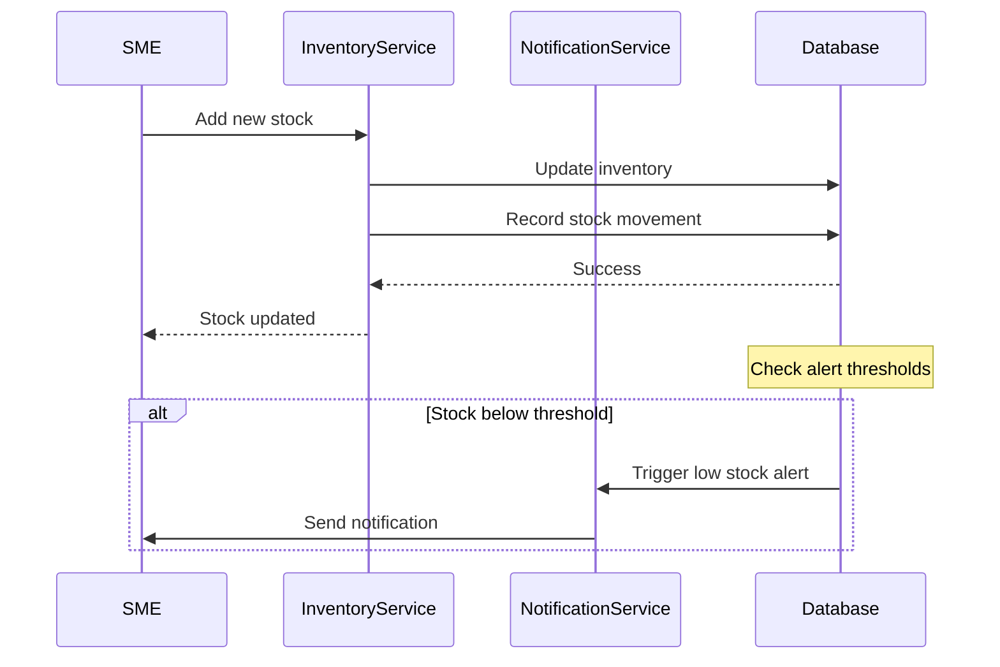
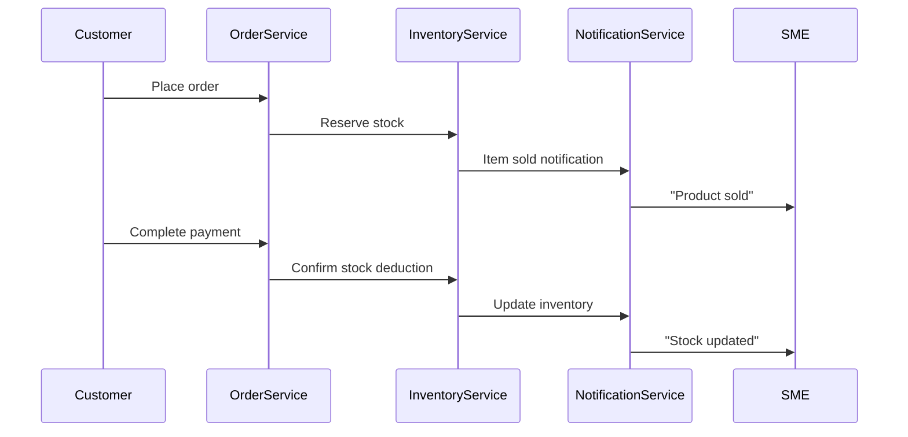
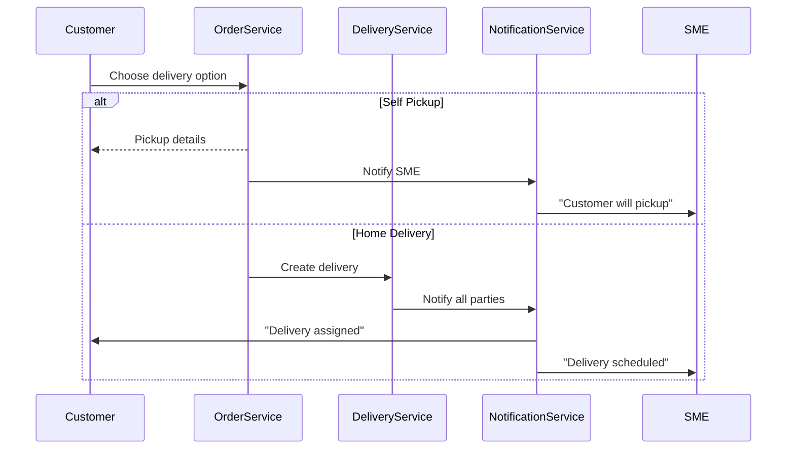
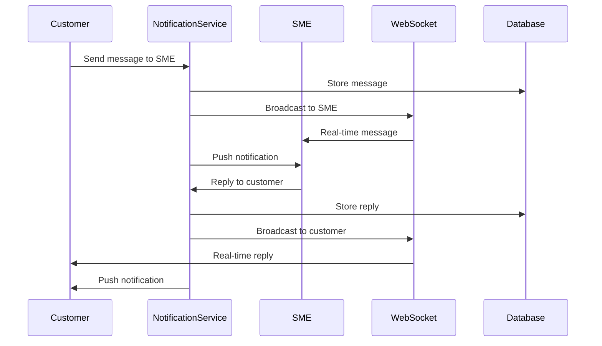

# Inventory & Notification Services Integration Guide

## Overview

This guide covers the complete integration of the Inventory Service and Notification Service, including SME stock management, in-app messaging, real-time notifications, and delivery updates.

---

## Inventory Service

### Base URL
```
http://localhost:8005/
```

### Features for SMEs

#### 1. Product Management

**Create Product**
```http
POST /products
Authorization: Bearer {retailer_token}
Content-Type: application/json

{
  "name": "Wireless Mouse",
  "description": "Ergonomic wireless mouse",
  "category_id": "uuid",
  "sku": "WM-001",
  "price": 75.00,
  "compare_at_price": 100.00,
  "cost_per_unit": 45.00,
  "image_url": "https://...",
  "tags": ["electronics", "computer accessories"],
  "initial_stock": 50,
  "warehouse_id": "uuid"
}
```

**List My Products**
```http
GET /products?status=active&limit=50
Authorization: Bearer {retailer_token}
```

**Update Product**
```http
PATCH /products/{product_id}
Authorization: Bearer {retailer_token}

{
  "name": "Updated Product Name",
  "price": 80.00,
  "status": "active"
}
```

#### 2. Stock Management

**Add Stock**
```http
POST /inventory/update
Authorization: Bearer {retailer_token}

{
  "product_id": "uuid",
  "warehouse_id": "uuid",
  "quantity_change": 100,
  "movement_type": "received",
  "cost_per_unit": 45.00,
  "notes": "Restocking from supplier"
}
```

**Adjust Stock (Sold)**
```http
POST /inventory/update
Authorization: Bearer {retailer_token}

{
  "product_id": "uuid",
  "warehouse_id": "uuid",
  "quantity_change": -5,
  "movement_type": "sold",
  "reference_id": "order_uuid",
  "notes": "Sold via order ORD-123"
}
```

**View Inventory**
```http
GET /inventory?warehouse_id={uuid}&low_stock_only=false
Authorization: Bearer {retailer_token}
```

#### 3. Low Stock Alerts

**Configure Alert Thresholds**
```http
POST /alerts/config
Authorization: Bearer {retailer_token}

{
  "product_id": "uuid",
  "warehouse_id": "uuid",
  "low_stock_threshold": 10,
  "reorder_point": 20,
  "max_stock_level": 500
}
```

**View Active Alerts**
```http
GET /alerts?alert_type=low_stock&acknowledged=false
Authorization: Bearer {retailer_token}
```

Response:
```json
{
  "alerts": [
    {
      "id": "uuid",
      "product_id": "uuid",
      "product_name": "Wireless Mouse",
      "warehouse_id": "uuid",
      "alert_type": "low_stock",
      "current_quantity": 8,
      "threshold": 10,
      "severity": "warning",
      "is_acknowledged": false,
      "created_at": "2024-12-14T10:30:00Z"
    }
  ]
}
```

**Acknowledge Alert**
```http
POST /alerts/{alert_id}/acknowledge
Authorization: Bearer {retailer_token}
```

#### 4. SME Dashboard

**Get Dashboard Summary**
```http
GET /dashboard/summary
Authorization: Bearer {retailer_token}
```

Response:
```json
{
  "total_products": 45,
  "active_products": 42,
  "total_stock_value": 125000.00,
  "low_stock_items": 5,
  "out_of_stock_items": 2,
  "recent_movements": [
    {
      "product_name": "Wireless Mouse",
      "movement_type": "sold",
      "quantity": 3,
      "performed_at": "2024-12-14T10:30:00Z"
    }
  ]
}
```

---

## Notification Service

### Base URL
```
http://localhost:8007/
```

### Features

#### 1. In-App Messaging (SME ↔ Customer)

**Start Conversation**
```http
POST /messages/conversations
Authorization: Bearer {user_token}

{
  "participant_id": "other_user_uuid",
  "initial_message": "Hello, I have a question about your product",
  "reference_type": "product",
  "reference_id": "product_uuid"
}
```

**Send Message**
```http
POST /messages/send
Authorization: Bearer {user_token}

{
  "conversation_id": "uuid",
  "content": "Is this item still in stock?",
  "message_type": "text"
}
```

**Get Conversations**
```http
GET /messages/conversations?unread_only=false
Authorization: Bearer {user_token}
```

Response:
```json
{
  "conversations": [
    {
      "id": "uuid",
      "participant_name": "John's Electronics",
      "participant_avatar": "https://...",
      "last_message": "Yes, we have 10 units in stock",
      "last_message_at": "2024-12-14T10:35:00Z",
      "unread_count": 2,
      "reference_type": "product",
      "reference_id": "product_uuid"
    }
  ]
}
```

**Get Messages**
```http
GET /messages/{conversation_id}?limit=50
Authorization: Bearer {user_token}
```

**Mark as Read**
```http
POST /messages/conversations/{conversation_id}/read
Authorization: Bearer {user_token}
```

#### 2. Push Notifications

**Get Notifications**
```http
GET /notifications?category=delivery&read=false&limit=20
Authorization: Bearer {user_token}
```

Response:
```json
{
  "notifications": [
    {
      "id": "uuid",
      "title": "Payment Received",
      "body": "Payment of ZMW 315.00 received for order ORD-123",
      "type": "success",
      "category": "payment",
      "reference_type": "payment",
      "reference_id": "payment_uuid",
      "is_read": false,
      "created_at": "2024-12-14T10:30:00Z"
    },
    {
      "id": "uuid",
      "title": "Low Stock Alert",
      "body": "Wireless Mouse stock is low (8 units remaining)",
      "type": "warning",
      "category": "inventory",
      "reference_type": "product",
      "reference_id": "product_uuid",
      "is_read": false,
      "created_at": "2024-12-14T09:15:00Z"
    }
  ]
}
```

**Mark as Read**
```http
POST /notifications/{notification_id}/read
Authorization: Bearer {user_token}
```

**Mark All as Read**
```http
POST /notifications/read-all
Authorization: Bearer {user_token}
```

#### 3. Notification Preferences

**Update Preferences**
```http
PUT /notifications/preferences
Authorization: Bearer {user_token}

{
  "email_enabled": true,
  "push_enabled": true,
  "sms_enabled": false,
  "categories": {
    "order_updates": true,
    "payment_notifications": true,
    "delivery_updates": true,
    "low_stock_alerts": true,
    "messages": true,
    "promotions": false
  }
}
```

#### 4. Real-Time WebSocket

**Connect to WebSocket**
```javascript
const ws = new WebSocket('ws://localhost:8007/ws');

ws.onopen = () => {
  // Authenticate
  ws.send(JSON.stringify({
    type: 'auth',
    token: 'Bearer {user_token}'
  }));
};

ws.onmessage = (event) => {
  const data = JSON.parse(event.data);
  
  switch(data.type) {
    case 'notification':
      // New notification received
      console.log('Notification:', data.notification);
      break;
      
    case 'message':
      // New message in conversation
      console.log('Message:', data.message);
      break;
      
    case 'delivery_update':
      // Delivery status changed
      console.log('Delivery:', data.delivery);
      break;
  }
};
```

---

## Integration Workflows

### 1. SME Stock Management Flow



### 2. Item Sold Workflow



### 3. Delivery Activation Flow



### 4. Messaging Between SME and Customer



---

## Notification Types

### For SMEs/Retailers

| Category | Type | Trigger | Example |
|----------|------|---------|---------|
| **Payment** | `payment_received` | Customer completes payment | "Payment of ZMW 315.00 received" |
| **Inventory** | `low_stock` | Stock below threshold | "Wireless Mouse stock is low (8 units)" |
| **Inventory** | `out_of_stock` | Stock reaches zero | "Product X is out of stock" |
| **Order** | `new_order` | Customer places order | "New order #ORD-123 received" |
| **Message** | `customer_inquiry` | Customer sends message | "New message from John Doe" |
| **Delivery** | `delivery_completed` | Order delivered | "Order #ORD-123 delivered successfully" |

### For Customers

| Category | Type | Trigger | Example |
|----------|------|---------|---------|
| **Order** | `order_confirmed` | Order placed | "Your order #ORD-123 is confirmed" |
| **Payment** | `payment_successful` | Payment completes | "Payment of ZMW 315.00 successful" |
| **Receipt** | `receipt_ready` | Receipt generated | "Your digital receipt is ready" |
| **Delivery** | `delivery_assigned` | Driver assigned | "Your order is out for delivery" |
| **Delivery** | `delivery_update` | Status changes | "Driver is 5 minutes away" |
| **Message** | `retailer_reply` | SME responds | "John's Electronics replied to you" |

---

## Testing

### Test Stock Management
```bash
# Add stock
curl -X POST "http://localhost:8005/inventory/update" \
  -H "Authorization: Bearer {retailer_token}" \
  -H "Content-Type: application/json" \
  -d '{
    "product_id": "uuid",
    "warehouse_id": "uuid",
    "quantity_change": 100,
    "movement_type": "received"
  }'

# Verify notification sent
curl -X GET "http://localhost:8007/notifications?category=inventory" \
  -H "Authorization: Bearer {retailer_token}"
```

### Test Messaging
```bash
# Start conversation
curl -X POST "http://localhost:8007/messages/conversations" \
  -H "Authorization: Bearer {customer_token}" \
  -H "Content-Type: application/json" \
  -d '{
    "participant_id": "retailer_uuid",
    "initial_message": "Hello, is this in stock?"
  }'

# Send message
curl -X POST "http://localhost:8007/messages/send" \
  -H "Authorization: Bearer {customer_token}" \
  -H "Content-Type: application/json" \
  -d '{
    "conversation_id": "conversation_uuid",
    "content": "How much does shipping cost?"
  }'
```

---

## Best Practices

### For SMEs

1. **Stock Management**
   - Set appropriate low stock thresholds
   - Regularly update inventory
   - Acknowledge alerts promptly
   - Use stock movement notes for tracking

2. **Customer Communication**
   - Respond to messages within 24 hours
   - Enable push notifications for new messages
   - Use message references to link to products/orders

3. **Notifications**
   - Don't disable payment notifications
   - Monitor low stock alerts daily
   - Review delivery updates for accuracy

### For Developers

1. **WebSocket Connections**
   - Implement reconnection logic
   - Handle authentication properly
   - Parse message types correctly

2. **Error Handling**
   - Check stock availability before selling
   - Validate warehouse IDs
   - Handle notification delivery failures

3. **Performance**
   - Paginate large result sets
   - Cache frequent queries
   - Use batch operations when possible

---

## Support & Resources

- **API Documentation**: See individual service README files
- **Database Schema**: Check migration files in `scripts/migrations/`
- **Sample Code**: Review test files in each service
- **Issues**: Report bugs via project repository
